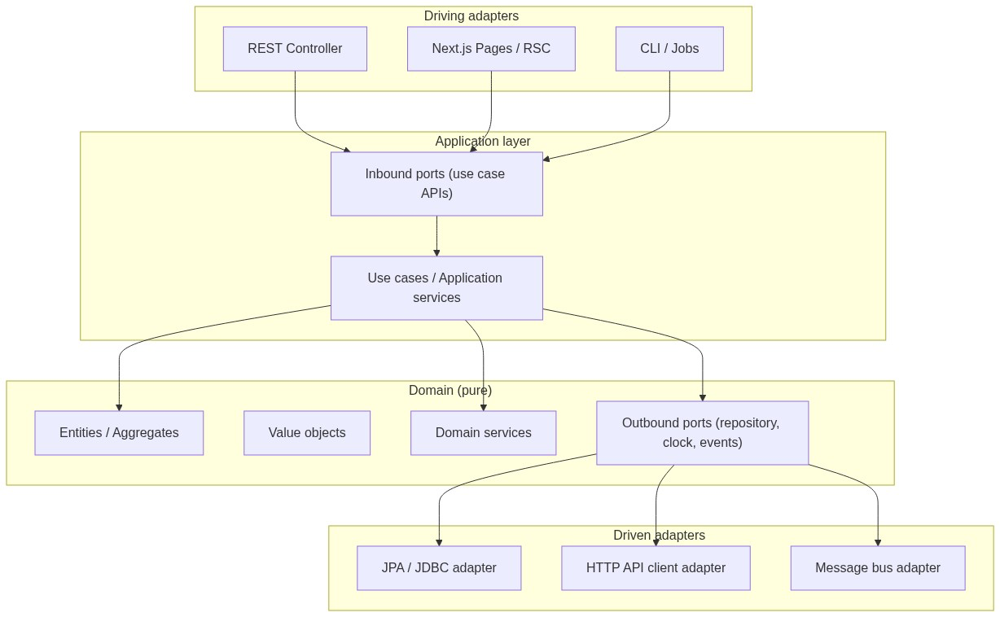

# Domain-Driven Design + Hexagonal Architecture (strict domain boundaries)

Hexagonal architecture with a **pure domain**: no Spring, JPA, React, Next.js, or HTTP imports in the core. The domain only knows the language (Java / TypeScript) and its own types.

## Non-negotiable principles


| Rule                                  | Description                                                                                                              |
| ------------------------------------- | ------------------------------------------------------------------------------------------------------------------------ |
| Dependencies point inward             | `interfaces` → `application` → `domain`. `infrastructure` → `domain` (implements ports). Never the reverse.              |
| Framework-agnostic domain             | Entities, VOs, business rules, and **outbound ports** live in `domain`. Zero framework annotations.                      |
| Ports in domain/application           | Interfaces the domain needs (persistence, clock, events) are defined as ports; implementations live in `infrastructure`. |
| Use cases in application              | Orchestration: load aggregates, invoke domain, persist via ports. No SQL, no `@RestController`, no `fetch`.              |
| Thin adapters                         | `interfaces` and `infrastructure` translate HTTP/JSON/JPA ↔ application commands/DTOs ↔ domain.                          |
| Separate persistence model            | In Java: JPA entities in `infrastructure`, not in `domain`. Explicit domain ↔ persistence model mapping.                 |
| One bounded context per module/folder | e.g. `contact` with its own `domain/application/...` tree.                                                               |


## Overview (hexagon)



**Driving (inbound):** actors that initiate actions (UI, REST API, cron).  
**Driven (outbound):** services the app consumes (database, external APIs, queues).

---

## Layers and sublayers

### 1. Domain (core)

Pure business logic. This is where the “what” of the system lives.


| Sublayer          | Responsibility                                | Examples                                    |
| ----------------- | --------------------------------------------- | ------------------------------------------- |
| `model`           | Entities, aggregates, roots                   | `Contact`, `ContactId`                      |
| `valueobject`     | Immutable value-identified objects            | `Email`, `PhoneNumber`                      |
| `service`         | Logic that does not belong to a single entity | `ContactUniquenessPolicy`                   |
| `event`           | Domain facts                                  | `ContactCreated`                            |
| `exception`       | Business errors                               | `DuplicateEmailException`                   |
| `port` (outbound) | Outward contracts                             | `ContactRepository`, `DomainEventPublisher` |


The domain **defines** outbound ports; it does not implement them.

### 2. Application

Orchestrates use cases. Knows domain and ports; does not know HTTP or JPA.


| Sublayer            | Responsibility                     | Examples                                   |
| ------------------- | ---------------------------------- | ------------------------------------------ |
| `port/in`           | Inbound ports (use case API)       | `CreateContactUseCase`                     |
| `service`           | Use case implementation            | `CreateContactService`                     |
| `command` / `query` | Use case input/output (light CQRS) | `CreateContactCommand`, `ContactListQuery` |
| `mapper` (optional) | Domain ↔ application result        | `ContactApplicationMapper`                 |


### 3. Interfaces (driving / inbound adapters)

Translates the outside world into application language.


| Sublayer       | Responsibility                     | Examples                                  |
| -------------- | ---------------------------------- | ----------------------------------------- |
| `rest` / `web` | Controllers, route handlers        | `ContactController`                       |
| `dto`          | HTTP request/response (not domain) | `CreateContactRequest`, `ContactResponse` |
| `mapper`       | HTTP DTO ↔ command/query           | `ContactRestMapper`                       |
| `exception`    | Domain exception → HTTP mapping    | `ContactExceptionHandler`                 |


### 4. Infrastructure (driven / outbound adapters)

Implements outbound ports with concrete technology.


| Sublayer             | Responsibility                 | Examples                     |
| -------------------- | ------------------------------ | ---------------------------- |
| `persistence`        | JPA, JDBC, Prisma client       | `JpaContactRepository`       |
| `persistence/model`  | Database entities (not domain) | `ContactJpaEntity`           |
| `persistence/mapper` | JPA entity ↔ domain            | `ContactPersistenceMapper`   |
| `config`             | Beans, Spring wiring           | `ContactPersistenceConfig`   |
| `client`             | External HTTP clients          | `ExternalCrmClient`          |
| `messaging`          | Actual event publishing        | `SpringDomainEventPublisher` |


### 5. Bootstrap / composition root (Java backend only)

Wires adapters and use cases (Spring `@Configuration`, Gradle modules). Not business logic.

---

## Backend Java (Spring Boot) — folder structure

Base package: `com.example.contact` (one bounded context per package).

```
backend/src/main/java/com/example/
├── contact/
│   ├── domain/
│   │   ├── model/
│   │   │   ├── Contact.java                 # Aggregate root; business methods (rename, deactivate)
│   │   │   └── ContactId.java               # Value object / typed identity
│   │   ├── valueobject/
│   │   │   ├── Email.java                   # Format validation in constructor
│   │   │   └── PhoneNumber.java
│   │   ├── service/
│   │   │   └── ContactUniquenessPolicy.java # Rule: unique email (uses port, no JPA)
│   │   ├── event/
│   │   │   └── ContactCreated.java
│   │   ├── exception/
│   │   │   ├── ContactNotFoundException.java
│   │   │   └── DuplicateEmailException.java
│   │   └── port/
│   │       ├── ContactRepository.java       # Outbound port: save, findById, findByEmail, delete
│   │       └── DomainEventPublisher.java    # Outbound port: publish(ContactCreated)
│   │
│   ├── application/
│   │   ├── port/in/
│   │   │   ├── CreateContactUseCase.java    # Inbound port: execute(CreateContactCommand)
│   │   │   ├── ListContactsUseCase.java
│   │   │   ├── UpdateContactUseCase.java
│   │   │   └── DeleteContactUseCase.java
│   │   ├── service/
│   │   │   ├── CreateContactService.java    # Implements CreateContactUseCase; orchestrates domain + repos
│   │   │   ├── ListContactsService.java
│   │   │   ├── UpdateContactService.java
│   │   │   └── DeleteContactService.java
│   │   └── command/
│   │       ├── CreateContactCommand.java    # Application primitives/DTO (no web annotations)
│   │       ├── UpdateContactCommand.java
│   │       └── ContactResult.java           # Use case output (not API JSON)
│   │
│   ├── interfaces/
│   │   └── rest/
│   │       ├── ContactController.java       # @RestController; delegates only to *UseCase
│   │       ├── dto/
│   │       │   ├── CreateContactRequest.java  # @Valid, Jackson; HTTP layer
│   │       │   ├── UpdateContactRequest.java
│   │       │   └── ContactResponse.java
│   │       ├── mapper/
│   │       │   └── ContactRestMapper.java   # Request → Command, ContactResult → Response
│   │       └── exception/
│   │           └── ContactExceptionHandler.java
│   │
│   └── infrastructure/
│       ├── persistence/
│       │   ├── ContactJpaEntity.java          # @Entity; infrastructure only
│       │   ├── SpringDataContactRepository.java  # JpaRepository interface
│       │   ├── JpaContactRepositoryAdapter.java  # implements domain.port.ContactRepository
│       │   └── ContactPersistenceMapper.java
│       ├── event/
│       │   └── SpringDomainEventPublisher.java   # implements DomainEventPublisher
│       └── config/
│           └── ContactModuleConfig.java       # @Bean wiring: use cases + adapters
│
└── ContactApplication.java                    # @SpringBootApplication
```

### Example flow: create contact

```
POST /api/contacts
  → ContactController
  → ContactRestMapper.toCommand(CreateContactRequest)
  → CreateContactUseCase.execute(command)
  → CreateContactService:
       - Email/PhoneNumber (VOs)
       - ContactUniquenessPolicy + ContactRepository.findByEmail
       - Contact.create(...)
       - ContactRepository.save
       - DomainEventPublisher.publish(ContactCreated)
  → ContactResult
  → ContactRestMapper.toResponse → 201
```

### Gradle dependencies (guidance)

- `contact-domain` module: **no** `spring-boot`, **no** `jakarta.persistence`.
- `contact-application` module: depends only on `contact-domain`.
- `contact-interfaces` + `contact-infrastructure`: depend on `application` + `domain`; Spring/JPA only here.

Monolith alternative: single module with **ArchUnit** or package rules forbidding `org.springframework.*` and `jakarta.persistence.*` under `domain/`**.

### Reference — pure domain (Java)

```java
// domain/model/Contact.java — no Spring, no JPA
public final class Contact {
    private final ContactId id;
    private Email email;
    private String name;

    public static Contact create(ContactId id, Email email, String name) {
        // business invariants
        return new Contact(id, email, name);
    }

    public void rename(String newName) { /* rules */ }
}
```

```java
// domain/port/ContactRepository.java
public interface ContactRepository {
    Optional<Contact> findById(ContactId id);
    Optional<Contact> findByEmail(Email email);
    Contact save(Contact contact);
    void delete(ContactId id);
}
```

---

## Frontend React (Next.js App Router) — folder structure

The frontend mirrors the same **layer intent**: thin UI, use cases, domain without React in pure rules.

```
frontend/src/
├── contact/                          # Bounded context (feature)
│   ├── domain/
│   │   ├── model/
│   │   │   ├── Contact.ts            # UI domain type/class (not the API DTO)
│   │   │   └── ContactId.ts
│   │   ├── valueobject/
│   │   │   ├── Email.ts              # validate(): Result or domain throw
│   │   │   └── PhoneNumber.ts
│   │   ├── service/
│   │   │   └── ContactFilterPolicy.ts  # e.g. client-side business filter/sort
│   │   ├── exception/
│   │   │   └── InvalidContactDataError.ts
│   │   └── port/
│   │       ├── ContactGateway.ts     # Outbound: list, get, create, update, delete
│   │       └── ContactQueryPort.ts   # Optional: specialized reads
│   │
│   ├── application/
│   │   ├── port/in/
│   │   │   ├── CreateContactUseCase.ts
│   │   │   ├── ListContactsUseCase.ts
│   │   │   └── DeleteContactUseCase.ts
│   │   ├── service/
│   │   │   ├── CreateContactService.ts
│   │   │   └── ListContactsService.ts
│   │   └── command/
│   │       ├── CreateContactCommand.ts
│   │       └── ContactViewModel.ts     # Presentation-ready output (no JSX)
│   │
│   ├── infrastructure/
│   │   ├── http/
│   │   │   ├── FetchContactGateway.ts    # implements ContactGateway (fetch/axios)
│   │   │   └── ContactApiDto.ts          # Backend JSON shape (anti-corruption)
│   │   ├── mapper/
│   │   │   └── ContactApiMapper.ts       # ApiDto ↔ domain Contact
│   │   └── config/
│   │       └── contactDependencies.ts    # Factory: gateway + use cases (composition root)
│   │
│   └── interfaces/
│       ├── ui/
│       │   ├── ContactList.tsx           # Props + callbacks only; no direct fetch
│       │   ├── ContactForm.tsx
│       │   └── ConfirmDeleteDialog.tsx
│       ├── hooks/
│       │   └── useContactList.ts         # Calls ListContactsUseCase; UI state
│       └── presenter/                    # Optional
│           └── ContactListPresenter.ts   # Maps ContactViewModel → UI props
│
├── app/                                  # Next.js — driving adapters
│   ├── contacts/
│   │   ├── page.tsx                      # Server/Client Component; injects use cases
│   │   └── [id]/page.tsx
│   └── layout.tsx
│
└── shared/                               # Non-business cross-cutting
    ├── ui/                               # Design system (Button, Input)
    └── lib/
```

### Frontend sublayers (detail)


| Layer            | Belongs here                                           | Does NOT belong here                         |
| ---------------- | ------------------------------------------------------ | -------------------------------------------- |
| `domain`         | Email validation, form business rules, `Contact` model | `useState`, `fetch`, `next/navigation`       |
| `application`    | `ListContactsService`, gateway + domain composition    | JSX, Tailwind, components                    |
| `infrastructure` | `FetchContactGateway`, JSON mapping, `API_URL` env     | “if duplicate email…” logic (domain/backend) |
| `interfaces`     | Components, hooks calling use cases                    | Direct `fetch` in `.tsx`                     |
| `app/`           | Routes, layouts, metadata, DI composition              | Business rules                               |


### Example flow: list contacts (client)

```
page.tsx / useContactList
  → listContacts() from contactDependencies
  → ListContactsUseCase.execute()
  → ListContactsService → ContactGateway.list()
  → FetchContactGateway → GET /api/contacts
  → ContactApiMapper.toDomain(dto)[]
  → ContactFilterPolicy.apply (domain)
  → ContactViewModel[]
  → ContactList.tsx (presentation)
```

### Reference — pure domain (TypeScript)

```typescript
// domain/valueobject/Email.ts — no React
export class Email {
  private constructor(private readonly value: string) {}

  static create(raw: string): Email {
    if (!/^[^\s@]+@[^\s@]+\.[^\s@]+$/.test(raw)) {
      throw new InvalidContactDataError('Invalid email');
    }
    return new Email(raw.toLowerCase());
  }

  toString(): string {
    return this.value;
  }
}
```

```typescript
// domain/port/ContactGateway.ts
export interface ContactGateway {
  list(): Promise<Contact[]>;
  create(command: CreateContactCommand): Promise<Contact>;
  delete(id: ContactId): Promise<void>;
}
```

```typescript
// interfaces/hooks/useContactList.ts — thin adapter
export function useContactList(deps: ContactDependencies) {
  const [items, setItems] = useState<ContactViewModel[]>([]);
  useEffect(() => {
    deps.listContactsUseCase.execute().then(setItems);
  }, [deps]);
  return { items };
}
```

### Next.js: Server vs Client


| Location                                     | Hexagonal role                                                                       |
| -------------------------------------------- | ------------------------------------------------------------------------------------ |
| `app/contacts/page.tsx` (Server Component)   | Driving adapter: may instantiate gateway server-side and pass initial data           |
| `interfaces/hooks/*.ts` ('use client')       | Driving adapter for interactivity; still no domain rules                             |
| `infrastructure/http/FetchContactGateway.ts` | Driven adapter; on server use `fetch` with cookies/headers; same interface on client |


Keep **one** `ContactGateway` interface and two implementations if needed: `ServerContactGateway` / `BrowserContactGateway`.

---

## Backend ↔ frontend mapping


| Concept          | Java (backend)                | TypeScript (frontend)    |
| ---------------- | ----------------------------- | ------------------------ |
| Aggregate        | `domain/model/Contact`        | `domain/model/Contact`   |
| Outbound port    | `ContactRepository`           | `ContactGateway`         |
| Use case         | `CreateContactService`        | `CreateContactService`   |
| Inbound port     | `CreateContactUseCase`        | `CreateContactUseCase`   |
| Inbound adapter  | `ContactController`           | `page.tsx`, hooks        |
| Outbound adapter | `JpaContactRepositoryAdapter` | `FetchContactGateway`    |
| External DTO     | `CreateContactRequest` (REST) | `ContactApiDto` (JSON)   |
| Composition root | `ContactModuleConfig`         | `contactDependencies.ts` |


**Ubiquitous language** (Contact, Email, CreateContact) must align on both sides; HTTP/API types are anti-corruption layers in `interfaces` / `infrastructure`, not in `domain`.

---

## Testing per layer


| Layer          | Test type                      | Dependencies                                    |
| -------------- | ------------------------------ | ----------------------------------------------- |
| Domain         | Pure unit                      | None                                            |
| Application    | Unit with fake/in-memory ports | Mocks of `ContactRepository` / `ContactGateway` |
| Infrastructure | Integration                    | Testcontainers / MSW                            |
| Interfaces     | WebMvc / Playwright / RTL      | Running app or mocked use cases                 |


---

## PR review checklist

- Any `import org.springframework` or `jakarta.persistence` in `domain/` or `application/`?
- Any `fetch` or `useRouter` in `domain/`?
- Does the controller/component delegate only to the use case?
- Is the JPA entity only under `infrastructure/persistence`?
- Are outbound ports defined under `domain/port` (backend and frontend)?
- Are API DTOs never used inside the domain?

---

## Suggested next steps

1. Align `openspec/changes/contact-list-system/design.md` with this layout (incremental migration from controller/service/repository).
2. Add ArchUnit (backend) and ESLint `import/no-restricted-paths` (frontend).
3. Extract a Gradle `contact-domain` module with no Spring dependencies as a strict boundary proof.