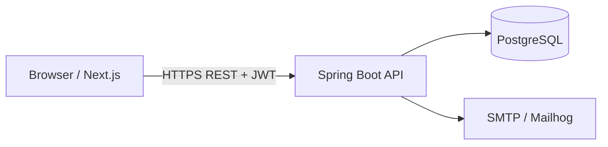
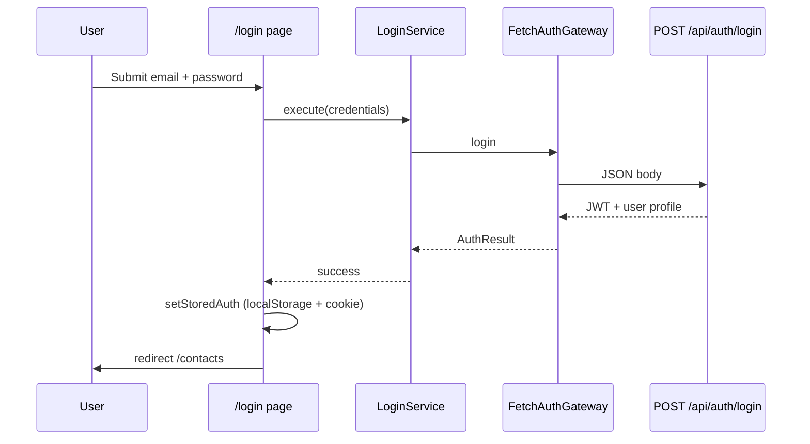
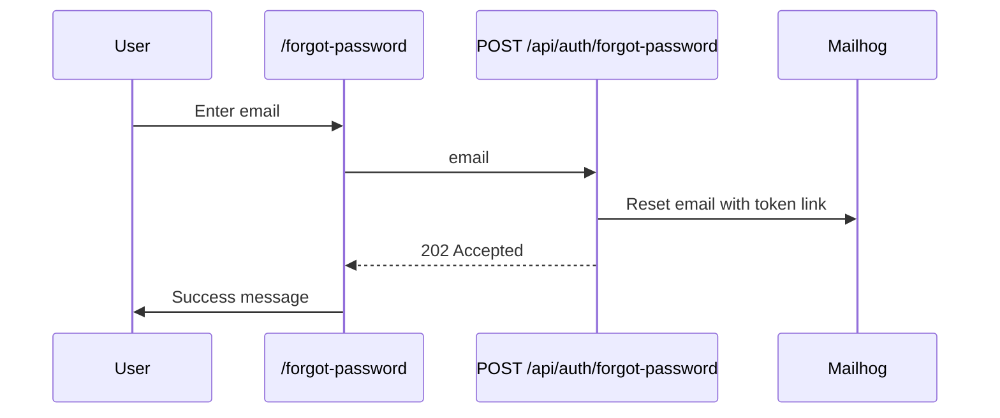

# Application flows

End-to-end behavior of Nexus CRM: how requests move through the UI, frontend modules, API, and bounded contexts. For setup and commands see [README.md](../../README.md); for agent verification see [AGENTS.md](../../AGENTS.md).

## System context



| Bounded context | API prefix | Frontend module |
|-----------------|------------|-----------------|
| identity | `/api/auth` | `frontend/src/identity` |
| contact | `/api/contacts` | `frontend/src/contact` |
| user | `/api/users` | `frontend/src/user` |

---

## Authentication and session

### Login



1. User opens `/login` (public; middleware allows without cookie).
2. `LoginService` calls `AuthGateway.login` → `POST /api/auth/login`.
3. Backend `LoginUseCase` validates credentials, returns JWT and role.
4. Frontend stores token and profile in `localStorage` (`nexus_auth`) and sets cookie `nexus_auth=1` for middleware.
5. Subsequent API calls use `apiFetch` with `Authorization: Bearer <token>`.

### Register

Same path as login, starting at `/register` → `POST /api/auth/register` → `201` with token → store auth → redirect to `/contacts`.

New users receive a default role from the backend registration policy (typically **VIEWER** unless changed in application logic).

### Session guard (app shell)

```mermaid
flowchart TD
  R[Request /contacts or /admin/*]
  M{middleware: cookie nexus_auth?}
  L[/login redirect]
  A[App layout useAuth]
  T{token in localStorage?}
  ME[GET /api/auth/me]
  OK[Render AppShell]

  R --> M
  M -->|no| L
  M -->|yes| A
  A --> T
  T -->|no| L
  T -->|yes| ME
  ME -->|401| L
  ME --> OK
```

- **Edge:** `middleware.ts` blocks unauthenticated access to `/contacts` and `/admin` using the cookie only.
- **Client:** `(app)/layout.tsx` loads `useAuth`, optionally refreshes via `/api/auth/me`, and redirects to `/login` if invalid.

### Logout

1. User triggers logout in `AppShell`.
2. `POST /api/auth/logout` (stateless acknowledgement).
3. `clearStoredAuth()` removes localStorage and cookie.
4. Redirect to `/login`.

### Forgot password



1. User submits email on `/forgot-password`.
2. API always responds `202` for valid requests (no email enumeration in UI).
3. Email contains a link to `/reset-password?token=...` (token from backend).
4. In local Docker, open http://localhost:8025 to read the message.

### Reset password

1. User lands on `/reset-password` with `token` query param.
2. `POST /api/auth/reset-password` with `{ token, newPassword }`.
3. On success, user can log in at `/login` with the new password.

---

## Contact management

### Directory (list)

| Step | Layer | Action |
|------|-------|--------|
| 1 | Route `/contacts` | `useContactDirectory` loads page |
| 2 | Application | `ListContactsService` |
| 3 | Infrastructure | `GET /api/contacts?search=&page=&size=&sort=` |
| 4 | API | `ListContactsUseCase` → repository query |

All authenticated roles may list. Search and pagination are query parameters on the same endpoint.

### Create contact

```mermaid
flowchart LR
  UI[/contacts/new]
  S[CreateContactService]
  API[POST /api/contacts]
  DOM[Contact aggregate]

  UI --> S --> API --> DOM
```

- Route: `/contacts/new`.
- Requires **ADMIN** or **EDITOR** on API (`@PreAuthorize`).
- **VIEWER** sees UI routes but receives **403** if they attempt create (API enforcement).

### Contact detail

| Step | Description |
|------|-------------|
| 1 | `/contacts/[id]` loads `useContactDetail` |
| 2 | `GET /api/contacts/{id}` returns contact with nested `tags`, `notes`, `activities` when present |
| 3 | UI tabs: Activity, Notes, Company (read-only company fields from contact) |

### Update / delete

| Action | Route | API |
|--------|-------|-----|
| Edit | `/contacts/[id]/edit` | `PUT /api/contacts/{id}` |
| Delete | UI confirm dialog | `DELETE /api/contacts/{id}` |

Mutations: **ADMIN**, **EDITOR** only.

### Avatar upload

`POST /api/contacts/{id}/avatar` (`multipart/form-data`). Files stored under `APP_AVATAR_STORAGE_PATH`; served at `/avatars/**` (public read).

### Notes and activities

| Flow | API | Role (write) |
|------|-----|----------------|
| List notes | `GET /api/contacts/{id}/notes` | Any authenticated |
| Add note | `POST /api/contacts/{id}/notes` | ADMIN, EDITOR |
| List activities | `GET /api/contacts/{id}/activities` | Any authenticated |
| Log activity | `POST /api/contacts/{id}/activities` | ADMIN, EDITOR |
| Replace tags | `PUT /api/contacts/{id}/tags` | ADMIN, EDITOR |

Frontend: detail page displays notes and activities; `FetchContactGateway.addNote` supports creating notes from the client when wired in UI.

### Duplicate email

Create/update runs `ContactUniquenessPolicy` in the domain. Duplicate email returns **409** with a structured error body; `ContactExceptionHandler` maps domain exceptions to HTTP.

---

## User administration (ADMIN)

Only users with role **ADMIN** may call `/api/users/**`. Frontend hides **Admin Panel** navigation for non-admins.

```mermaid
flowchart TD
  A[ADMIN user]
  P[/admin/users]
  L[GET /api/users]
  S[GET /api/users/stats]
  C[POST /api/users]
  I[POST /api/users/invite]
  U[PUT /api/users/id]
  D[DELETE /api/users/id]

  A --> P
  P --> L
  P --> S
  P --> C
  P --> I
  P --> U
  P --> D
```

| Flow | API | Outcome |
|------|-----|---------|
| List team | `GET /api/users` | All users with roles and status |
| Dashboard stats | `GET /api/users/stats` | Counts for admin UI |
| Create user | `POST /api/users` | Direct account with password |
| Invite user | `POST /api/users/invite` | Invitation email via SMTP |
| Update user | `PUT /api/users/{id}` | Role, name, status, etc. |
| Delete user | `DELETE /api/users/{id}` | `204` |

Invite and password-reset emails use the same mail infrastructure as auth (Mailhog in Docker).

---

## Role-based access summary

```mermaid
flowchart TB
  subgraph Public
    auth[/api/auth/login register forgot reset]
    swagger[Swagger / api-docs]
    avatars[/avatars/**]
  end

  subgraph Authenticated
    readC[GET contacts notes activities]
    writeC[POST PUT DELETE contacts sub-resources]
    users[/api/users ADMIN only]
  end

  auth --> Authenticated
  readC --> writeC
```

| Role | Read contacts | Write contacts | `/api/users` |
|------|---------------|----------------|--------------|
| VIEWER | yes | no | no |
| EDITOR | yes | yes | no |
| ADMIN | yes | yes | yes |

---

## Data and migrations

- Schema owned by **Liquibase** (`backend/src/main/resources/db/changelog/`).
- Hibernate `ddl-auto: validate` — agents must not rely on auto-ddl.
- Seed user `admin@nexuscrm.com` inserted in changelog `006-create-users-and-roles.yaml`.

---

## UI routes map

| Route | Flow |
|-------|------|
| `/` | Redirect to `/login` |
| `/login` | Authentication |
| `/register` | Self-registration |
| `/forgot-password` | Start password reset |
| `/reset-password` | Complete password reset |
| `/contacts` | Contact directory |
| `/contacts/new` | Create contact |
| `/contacts/[id]` | Contact detail (notes/activity tabs) |
| `/contacts/[id]/edit` | Update contact |
| `/admin/users` | User administration (ADMIN) |

Design reference screens for these flows live under [docs/design/stitch/](../design/stitch/README.md).
